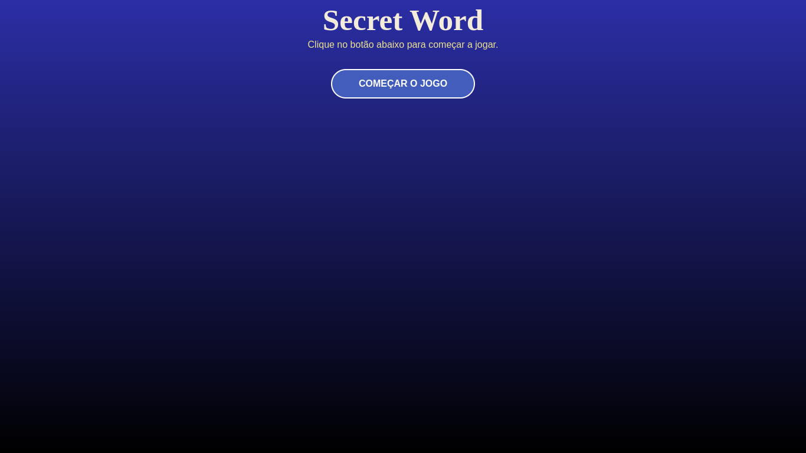

# Finalizando a tela Inicial

## Resumo

## Código Usados

App.jsx

```jsx
import "./App.css"
import StartScreen from "./components/StartScreen"

function App() {
  return (
    <>
      <div className="App">
        <StartScreen />
      </div>
    </>
  )
}

export default App
```

index.css

```jsx
html,
body {
  height: 100%;
}
body {
  margin: 0;
  padding: 0;
  font-family: Arial, Helvetica, sans-serif;
  background: linear-gradient(
    180deg,
    rgba(9, 35, 175, 1) 0%,
    rgba(0, 0, 0, 1) 100%
  );
  color: antiquewhite;
}

button {
  background: #005cc5;
  color: #fff;
  padding: 0 45px;
  border: 2px solid #fff;
  border-radius: 25px;
  height: 50px;
  text-transform: uppercase;
  font-weight: bold;
  font-size: 1rem;
  cursor: pointer;
  transition: 0.4s;
}

button:hover{
    background-color: darkblue;
    border: 2px solid #f49f00;
}
```

## Components

Os componentes estão inseridos na pasta `src/components/...`

StartScreen.jsx

```jsx
import './index.css'

const StartScreen = () => {
  return (
    <div className='start'>
        <h1 className="title">Secret Word</h1>
        <p>Clique no botão abaixo para começar a jogar.</p>
        <button>Começar o jogo</button>
    </div>
  )
}

export default StartScreen
```

StartScreen.css

```css
.start .title {
  margin-top: 0.25rem;
  margin-bottom: 0.25rem;
  font-size: 3.2rem;
  font-family: cursive;
}

.start p {
  margin-top: .25rem;
  margin-bottom: 2rem;
  padding: 0;
  color: #F5E27C;
}
```

## ScreenShot


