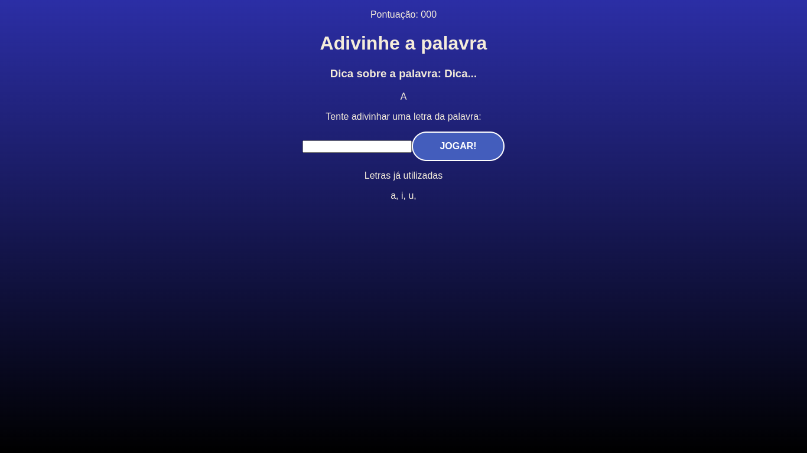

# Estruturando componente do jogo

## Resumo

Estrutura da tela do jogo.

###### Game.jsx

```jsx
/* eslint-disable react/prop-types */
import "./index.css"

const Game = ({ verifyLetter }) => {
  return (
    <div className="game">
      <p className="points">
        <span>Pontuação: 000</span>
      </p>
      <h1>Adivinhe a palavra</h1>
      <h3 className="tip">
        Dica sobre a palavra: <span>Dica...</span>
      </h3>
      <div className="word-container">
        <span className="letter">A</span>
        <span className="blank-square"></span>
      </div>
      <div className="letter-container">
        <p>Tente adivinhar uma letra da palavra: </p>
        <form>
          <input type="text" name="letter" maxLength="1" required />
          <button>Jogar!</button>
        </form>
      </div>
      <div className="wrong-letter-container">
        <p>Letras já utilizadas</p>
        <span>a, </span>
        <span>i, </span>
        <span>u, </span>
      </div>
    </div>
  )
}

export default Game

```

###### Tela


