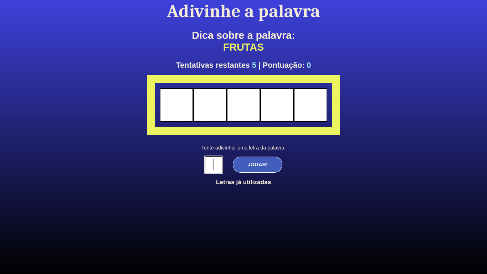

# Conclusão - Projeto Secreat Word

## Resumo

## Conceitos abordados:

Navegação por componentes, com verificação na alteração de estados, passagem de parâmetros em componentes.

### useRef

`useRef` é um hook no React que permite criar uma referência para um elemento do DOM ou para um valor mutável que pode ser acessado diretamente. Ele é útil para interações com o DOM, animações, foco de elementos, integrações com bibliotecas que não funcionam bem com o modelo de dados do React, como jQuery, e para manter valores entre renderizações sem acionar uma nova renderização quando o valor muda.

Aqui estão alguns cenários comuns em que você pode usar `useRef`:

1. **Referência a elementos do DOM**: Você pode criar uma referência a um elemento do DOM para interagir diretamente com ele. Por exemplo:

```jsx
import React, { useRef } from 'react';

function MeuComponente() {
  const meuElementoRef = useRef(null);

  const handleClick = () => {
    meuElementoRef.current.focus();
  };

  return (
    <div>
      <input ref={meuElementoRef} />
      <button onClick={handleClick}>Focar no Input</button>
    </div>
  );
}
```

2. **Mantendo valores entre renderizações**: Você pode usar `useRef` para manter valores que não devem acionar uma nova renderização quando mudam. O valor em um objeto `ref` persiste entre renderizações. Por exemplo:

```jsx
import React, { useRef, useEffect } from 'react';

function MeuComponente() {
  const contador = useRef(0);

  useEffect(() => {
    contador.current += 1;
    console.log('Contador atual:', contador.current);
  }, []);

  return <div>Contador: {contador.current}</div>;
}
```

3. **Integração com bibliotecas externas**: `useRef` é frequentemente usado para integrar o React com bibliotecas que manipulam diretamente o DOM, como gráficos ou animações.

Lembre-se de que, ao usar `useRef`, você está trabalhando fora do ciclo de renderização normal do React, e as alterações em `ref` não acionarão uma nova renderização. Portanto, é importante usá-lo com cuidado e em cenários apropriados, principalmente quando a manipulação direta do DOM é necessária.

### useCallback

O hook `useCallback` é usado em React para memoizar funções. Isso significa que ele retorna a mesma função sempre que suas dependências não mudam, o que pode melhorar o desempenho em casos onde funções são passadas como propriedades para componentes filhos e evita recriações desnecessárias de funções.

A assinatura básica do `useCallback` é a seguinte:

```jsx
const memoizedCallback = useCallback(callback, dependencies);
```

- `callback`: A função que você deseja memoizar.
- `dependencies` (opcional): Um array de dependências. Se qualquer uma das dependências mudar entre renderizações, a função será recriada; caso contrário, a função memoizada existente será retornada.

A principal situação em que você usaria `useCallback` é quando precisa passar uma função como propriedade para um componente filho e deseja evitar que essa função seja recriada a cada renderização do componente pai. Isso é especialmente útil quando essa função é usada como propriedade de um componente filho com a função `memo` ou quando você deseja otimizar o desempenho em geral.

Aqui está um exemplo de uso do `useCallback`:

```jsx
import React, { useState, useCallback } from 'react';

function Botao({ onClick }) {
  return <button onClick={onClick}>Clique-me</button>;
}

function App() {
  const [contador, setContador] = useState(0);

  // Usando useCallback para memoizar a função de clique
  const handleClick = useCallback(() => {
    setContador(contador + 1);
  }, [contador]);

  return (
    <div>
      <p>Contagem: {contador}</p>
      <Botao onClick={handleClick} />
    </div>
  );
}

export default App;
```

Neste exemplo, usamos `useCallback` para memoizar a função `handleClick`. Como a única dependência é `contador`, a função será recriada somente quando `contador` mudar. Isso evita que uma nova função seja criada a cada renderização de `App`, o que pode melhorar o desempenho em aplicativos maiores ou em situações onde a renderização é frequentemente acionada.

Lembre-se de que o uso de `useCallback` é uma otimização e deve ser aplicado quando necessário. Não é necessário em todos os casos, mas pode ser útil em situações específicas para evitar a recriação desnecessária de funções.

### Passagem de parâmetros e funções em componentes

A passagem de parâmetros e funções entre componentes é uma parte fundamental do desenvolvimento de aplicativos React. Isso permite que você compartilhe dados e comportamentos entre componentes de maneira eficiente. Vou explicar como passar parâmetros e funções entre componentes.

### Passagem de Parâmetros

#### 1. Passagem de parâmetros via Props

Você pode passar dados de um componente pai para um componente filho via props (propriedades). Para isso, basta definir um atributo no componente filho e atribuir um valor a ele quando você o renderiza no componente pai.

Exemplo:

```jsx
// Componente Pai
import React from 'react';
import ComponenteFilho from './ComponenteFilho';

function App() {
  const mensagem = "Olá, mundo!";

  return (
    <div>
      <ComponenteFilho mensagem={mensagem} />
    </div>
  );
}

// Componente Filho
import React from 'react';

function ComponenteFilho(props) {
  return <div>{props.mensagem}</div>;
}
```

Neste exemplo, a mensagem é passada do componente pai para o componente filho por meio de uma prop chamada `mensagem`.

#### 2. Passagem de parâmetros via Route Params (React Router)

Se você estiver usando o React Router, pode passar parâmetros pela URL usando `Route Params`. Isso é útil para criar rotas dinâmicas.

Exemplo:

```jsx
// Defina uma rota com parâmetros
<Route path="/user/:id" component={UserProfile} />

// No componente UserProfile, você pode acessar o parâmetro assim:
const { id } = useParams();
```

### Passagem de Funções

#### 1. Passagem de Funções via Props

Assim como passar dados, você pode passar funções de um componente pai para um componente filho via props. Isso permite que o componente filho chame a função definida no componente pai.

Exemplo:

```jsx
// Componente Pai
import React, { useState } from 'react';
import ComponenteFilho from './ComponenteFilho';

function App() {
  const [contador, setContador] = useState(0);

  const incrementarContador = () => {
    setContador(contador + 1);
  };

  return (
    <div>
      <ComponenteFilho incrementar={incrementarContador} />
      <p>Contador: {contador}</p>
    </div>
  );
}

// Componente Filho
import React from 'react';

function ComponenteFilho(props) {
  return <button onClick={props.incrementar}>Incrementar</button>;
}
```

Neste exemplo, a função `incrementarContador` é passada para o componente filho `ComponenteFilho` via props e é chamada quando o botão no componente filho é clicado.

#### 2. Passagem de Funções via Context API

A Context API do React permite que você compartilhe dados e funções entre componentes sem a necessidade de passá-los manualmente por meio de props. É útil quando você tem vários níveis de componentes entre o componente pai e o filho.

Exemplo:

```jsx
// Criar um contexto
const MeuContexto = React.createContext();

// Componente Pai
import React, { useContext } from 'react';

function App() {
  const incrementar = () => {
    // Lógica de incremento
  };

  return (
    <MeuContexto.Provider value={incrementar}>
      {/* Renderizar componentes filhos aqui */}
    </MeuContexto.Provider>
  );
}

// Componente Filho
import React, { useContext } from 'react';
import MeuContexto from './MeuContexto';

function ComponenteFilho() {
  const incrementar = useContext(MeuContexto);

  return <button onClick={incrementar}>Incrementar</button>;
}
```

Neste exemplo, a função `incrementar` é disponibilizada para o componente `ComponenteFilho` usando a Context API. O componente filho pode acessá-la por meio do hook `useContext`.

A escolha entre passar parâmetros e funções via props ou usando a Context API depende das necessidades específicas do seu aplicativo. Em geral, props são adequadas para a passagem de dados simples e funções para comportamento ou ações que precisam ser executadas em outro componente. A Context API é útil quando você precisa compartilhar dados ou funções entre componentes que não têm uma relação direta pai-filho.

## Conclusão

### Telas da aplicação

Tela inicial


Tela do jogo



Tela fim de jogo


